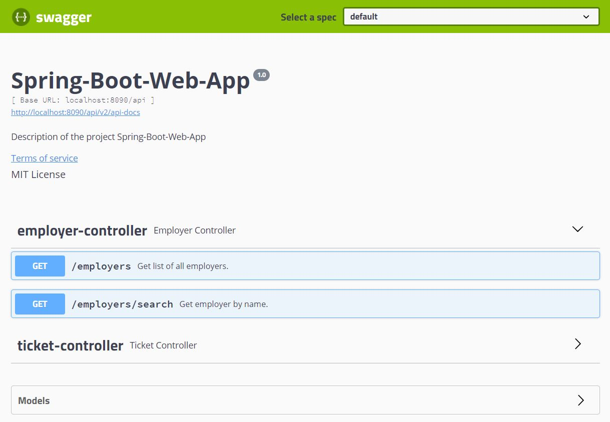
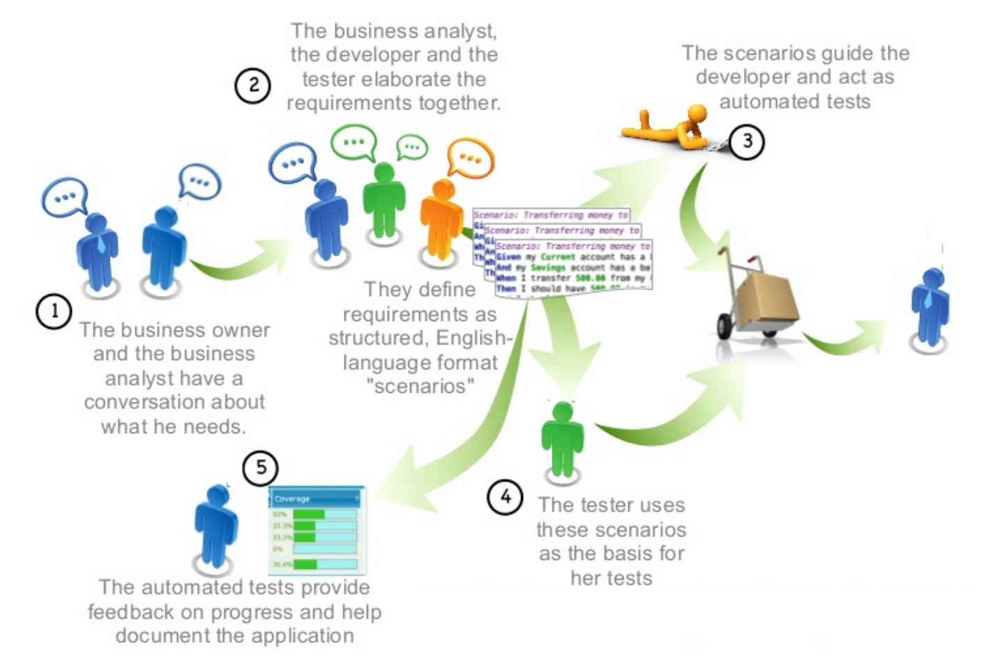

# Spring-Boot-Web-App

[](https://travis-ci.org/medJarray/Spring-Boot-Web-App)

[](https://codecov.io/gh/Raouf25/Spring-Boot-Web-App)

[](https://sonarcloud.io/dashboard?id=com.springApp%3Aspring5webapp)


## Why I should use DTOs in your REST API
DTO stands for Data Transfer Object. The  advantage of using DTOs on RESTful APIs is that they can help hiding implementation details of domain objects (aka. entities). 
Exposing entities through endpoints can become a security issue if we do not carefully handle what properties can be changed through what operations.

As an example, let's imagine a Java API that exposes user details and accepts user updates through two endpoints. 
The first endpoint would handle GET requests and return user data, and the second endpoint would accept PUT requests to update these details. 
If this application didn't take advantage of DTOs, all the properties of the user would be exposed in the first endpoint (e.g. password) and 
the second endpoint would have to be very selective on what properties would accept when updating a user (e.g. not everybody can update the roles of a user).

To overcome this situation, DTOs can come in handy by exposing only what the first endpoint is intended to expose, and by helping the second endpoint to restrict what it accepts. 
This characteristic helps us to keep the integrity of the data in our applications.


## Dealing with the boilerplate code
You won't need to map your persistence entities to DTOs and vice versa manually. There are many mapping frameworks you can use to do it. For instance, have a look at MapStruct, which is annotation based and works as a Maven Annotation Processor. It works well in CDI(context and dependency injection) and Spring-based applications.

Also consider Lombok to generate getters, setters, equals(), hashcode() and toString() methods for you.


## Documenting REST API with Swagger

To properly document the available endpoints in your REST API, which endpoints there are, what they can do, what they need as input parameters and what they will provide as output. A popular standard, that is used for this, is Swagger.

After running the application, go to http://localhost:8090/api/swagger-ui.html. If you see a blank screen, you might have to refresh once, but normally you’ll see a screen like this:



## Spring Boot REST Internationalization

Let's make simple requests using CURL:
```console
$ curl -X GET "http://localhost:8090/api/employers/search?name=toto" -H "accept: application/json" -H  "Accept-Language: fr"
On peut pas trouver l emplyeur toto
```
```console
$ curl -X GET "http://localhost:8090/api/employers/search?name=toto" -H "accept: application/json" -H  "Accept-Language: en"
Could not find employee toto
```
```console
$ curl -X GET "http://localhost:8090/api/employers/search?name=toto" -H "accept: application/json"
On peut pas trouver l emplyeur toto
```
So as you see, responses are different based on value of “Accept-Language” header passed in the request. This way, we don’t need to check what was passed in the request in each controller method, and then pass it further to service layers. We now can do this in one single place, which is CustomLocaleResolver class.


## Behaviour-Driven Development methodology
Behavior-Driven Development aka BDD, its intent is to enable developers to write high-level use cases in plain text that can be verified by non-technical stakeholders, and turn them into executable tests, written in a language called Gherkin.



just 5 step recipe for making it work :
1. Configure the build script
2. Write the Gherkin tests
3. Implement the Gherkin steps test code
4. Implement the feature being tested
5. Run the Gherkin tests and get the result

Results of test are saved in : target/cucumber-reports/index.html

### References: 
* [REST API - DTOs or not?](https://stackoverflow.com/a/36175349/8956678)
* [Automatically Mapping DTO to Entity on Spring Boot APIs](https://auth0.com/blog/automatically-mapping-dto-to-entity-on-spring-boot-apis)
* [Rédiger des spécifications - La syntaxe Gherkin](https://github.com/Behat/fr-docs.behat.org/blob/master/guides/1.gherkin.rst)
* [Spring Boot 1.4: Gherkin tests](https://moelholm.com/2016/10/15/spring-boot-1-4-gherkin-tests/)
to see
https://univers-architecture.com/2017/12/11/tutoriel-integration-de-cucumber-avec-spring-boot/